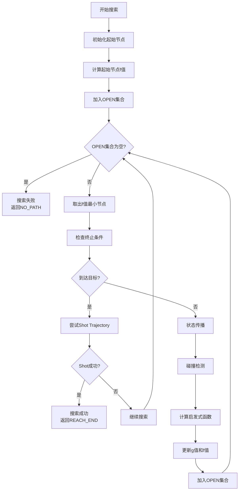
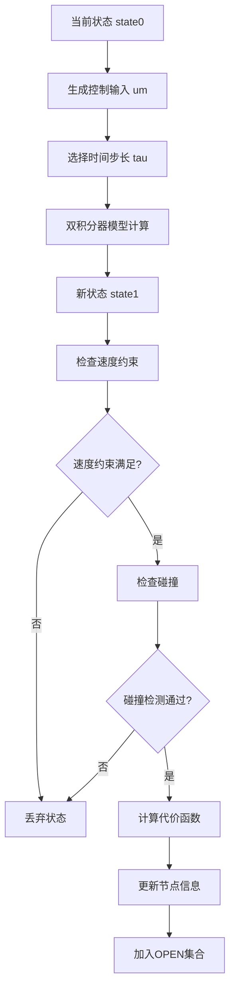

# Fast-Planner KinodynamicAstar 源码深度解读指南

## 📖 目录

1. [算法概述与核心思想](#1-算法概述与核心思想)
2. [数据结构详解](#2-数据结构详解)
3. [核心算法流程](#3-核心算法流程)
4. [关键函数深度解析](#4-关键函数深度解析)
5. [数学原理与公式推导](#5-数学原理与公式推导)
6. [代码实现细节](#6-代码实现细节)
7. [性能优化策略](#7-性能优化策略)
8. [调试与可视化](#8-调试与可视化)
9. [常见问题解答](#9-常见问题解答)
10. [扩展与改进建议](#10-扩展与改进建议)

---

## 1. 算法概述与核心思想

### 1.1 算法背景

KinodynamicAstar 是 Fast-Planner 项目中的核心路径搜索算法，专门为无人机等动态系统设计。它解决了传统 A* 算法无法处理动力学约束的问题。

### 1.2 核心创新点

1. **6维状态空间**: 从传统的3D位置空间扩展到 `[x, y, z, vx, vy, vz]`
2. **动力学约束**: 集成速度、加速度限制到搜索过程中
3. **时间维度**: 支持动态环境中的4D搜索 `(x, y, z, t)`
4. **启发式设计**: 平衡路径长度和时间成本

### 1.3 算法优势

- ✅ **动力学可行性**: 生成的路径满足系统动力学约束
- ✅ **实时性**: 通过启发式搜索保证实时性能
- ✅ **鲁棒性**: 支持动态环境和复杂约束
- ✅ **可扩展性**: 模块化设计便于扩展

---

## 2. 数据结构详解

### 2.1 PathNode 结构体

```cpp
class PathNode {
public:
    Eigen::Vector3i index;           // 3D网格索引 (x,y,z)
    Eigen::Matrix<double, 6, 1> state; // 6维状态 [x,y,z,vx,vy,vz]
    double g_score, f_score;         // A*算法的g值和f值
    Eigen::Vector3d input;           // 控制输入 [ax,ay,az]
    double duration;                 // 时间步长 (从父节点到当前节点)
    double time;                     // 时间戳 (从起始节点到当前节点的总时间)
    int time_idx;                    // 时间索引 (用于4D搜索)
    PathNode* parent;                // 父节点指针
    char node_state;                 // 节点状态 (OPEN/CLOSE/NOT_EXPAND)
};
```

#### 字段详细说明

| 字段 | 类型 | 含义 | 用途 |
|------|------|------|------|
| `index` | `Vector3i` | 3D网格索引 | 空间离散化，用于哈希表查找 |
| `state` | `Matrix<6,1>` | 6维状态向量 | 存储位置和速度信息 |
| `g_score` | `double` | 实际代价 | 从起点到当前节点的累积代价 |
| `f_score` | `double` | 总代价 | f = g + h，用于优先级排序 |
| `input` | `Vector3d` | 控制输入 | 加速度向量，用于状态传播 |
| `duration` | `double` | 时间步长 | 从父节点到当前节点的时间 |
| `time` | `double` | 时间戳 | 从起始节点到当前节点的总时间 |
| `time_idx` | `int` | 时间索引 | 时间离散化，用于4D搜索 |
| `parent` | `PathNode*` | 父节点指针 | 用于路径回溯 |
| `node_state` | `char` | 节点状态 | 标记节点在搜索中的状态 |

### 2.2 KinodynamicAstar 类结构

```cpp
class KinodynamicAstar {
private:
    // 核心数据结构
    std::vector<PathNodePtr> path_node_pool_;      // 节点池
    std::priority_queue<PathNodePtr, std::vector<PathNodePtr>, NodeComparator> open_set_;  // OPEN集合
    NodeHashTable expanded_nodes_;                  // 已扩展节点哈希表
    
    // 搜索状态
    std::vector<PathNodePtr> path_nodes_;          // 最终路径节点
    int use_node_num_, iter_num_;                  // 节点计数和迭代计数
    
    // 环境接口
    std::shared_ptr<plan_env::EDTEnvironment> edt_environment_;  // EDT环境
    
    // 搜索参数
    double max_tau_, init_max_tau_;                // 最大时间步长
    double max_vel_, max_acc_;                     // 动力学约束
    double w_time_, horizon_, lambda_heu_;         // 权重参数
    double resolution_, time_resolution_;          // 分辨率
    Eigen::Vector3d origin_, map_size_3d_;         // 地图信息
    double time_origin_;                           // 时间原点
    
    // 状态转移矩阵
    Eigen::Matrix<double, 6, 6> phi_;              // 状态转移矩阵
};
```

---

## 3. 核心算法流程

### 3.1 主搜索循环



### 3.2 状态传播过程



---

## 4. 关键函数深度解析

### 4.1 主搜索函数 `search()`

```cpp
int KinodynamicAstar::search(Eigen::Vector3d start_pt, Eigen::Vector3d start_v, 
                            Eigen::Vector3d start_a, Eigen::Vector3d end_pt, 
                            Eigen::Vector3d end_v, bool init, bool dynamic, 
                            double time_start)
```

#### 函数签名解析

| 参数 | 类型 | 含义 |
|------|------|------|
| `start_pt` | `Vector3d` | 起始位置 [x,y,z] |
| `start_v` | `Vector3d` | 起始速度 [vx,vy,vz] |
| `start_a` | `Vector3d` | 起始加速度 [ax,ay,az] |
| `end_pt` | `Vector3d` | 目标位置 [x,y,z] |
| `end_v` | `Vector3d` | 目标速度 [vx,vy,vz] |
| `init` | `bool` | 是否初始化搜索 |
| `dynamic` | `bool` | 是否为动态环境 |
| `time_start` | `double` | 起始时间 |

#### 返回值

```cpp
enum { 
    REACH_HORIZON = 1,  // 到达搜索视野
    REACH_END = 2,      // 到达目标
    NO_PATH = 3,        // 无可行路径
    NEAR_END = 4        // 接近目标
};
```

#### 核心实现逻辑

```cpp
// 1. 初始化起始节点
PathNodePtr cur_node = path_node_pool_[0];
cur_node->parent = NULL;
cur_node->state.head(3) = start_pt;      // 位置
cur_node->state.tail(3) = start_v;       // 速度
cur_node->index = posToIndex(start_pt);  // 空间索引
cur_node->g_score = 0.0;                 // 起始代价为0

// 2. 计算启发式函数
cur_node->f_score = lambda_heu_ * estimateHeuristic(cur_node->state, end_state, time_to_goal);

// 3. 主搜索循环
while (!open_set_.empty()) {
    cur_node = open_set_.top();
    
    // 检查终止条件
    bool reach_horizon = (cur_node->state.head(3) - start_pt).norm() >= horizon_;
    bool near_end = /* 检查是否接近目标 */;
    
    if (reach_horizon || near_end) {
        // 尝试Shot Trajectory
        if (near_end) {
            estimateHeuristic(cur_node->state, end_state, time_to_goal);
            computeShotTraj(cur_node->state, end_state, time_to_goal);
        }
        // 返回相应状态
    }
    
    // 状态传播
    // ... 详细实现见后续章节
}
```

### 4.2 状态传播函数 `stateTransit()`

```cpp
void KinodynamicAstar::stateTransit(Eigen::Matrix<double, 6, 1>& state0,
                                    Eigen::Matrix<double, 6, 1>& state1, 
                                    Eigen::Vector3d um, double tau)
```

#### 数学原理

使用双积分器模型进行状态传播：

```
x(t+τ) = x(t) + v(t)τ + 0.5*a(t)τ²
v(t+τ) = v(t) + a(t)τ
```

#### 矩阵形式

```
state1 = Φ * state0 + integral
```

其中：
- `Φ` 是状态转移矩阵
- `integral` 是控制输入积分项

#### 代码实现

```cpp
void KinodynamicAstar::stateTransit(Eigen::Matrix<double, 6, 1>& state0,
                                    Eigen::Matrix<double, 6, 1>& state1, 
                                    Eigen::Vector3d um, double tau)
{
    // 更新状态转移矩阵中的时间项
    for (int i = 0; i < 3; ++i)
        phi_(i, i + 3) = tau;
    
    // 计算控制输入积分项
    Eigen::Matrix<double, 6, 1> integral;
    integral.head(3) = 0.5 * pow(tau, 2) * um;  // 位置积分项
    integral.tail(3) = tau * um;                // 速度积分项
    
    // 状态传播
    state1 = phi_ * state0 + integral;
}
```

#### 状态转移矩阵详解

```cpp
// phi_ 矩阵的初始化 (6x6单位矩阵)
phi_ = Eigen::MatrixXd::Identity(6, 6);

// 在状态传播时更新时间项
phi_(0, 3) = tau;  // x 对 vx 的依赖
phi_(1, 4) = tau;  // y 对 vy 的依赖  
phi_(2, 5) = tau;  // z 对 vz 的依赖
```

### 4.3 启发式函数 `estimateHeuristic()`

```cpp
double KinodynamicAstar::estimateHeuristic(Eigen::VectorXd x1, Eigen::VectorXd x2, 
                                          double& optimal_time)
```

#### 数学原理

启发式函数设计为时间-空间权衡：

```
h(n) = λ * ||p_goal - p_current|| + w_time * t_optimal
```

其中 `t_optimal` 通过求解四次多项式得到。

#### 四次多项式构建

```cpp
double KinodynamicAstar::estimateHeuristic(Eigen::VectorXd x1, Eigen::VectorXd x2, 
                                          double& optimal_time)
{
    const Vector3d dp = x2.head(3) - x1.head(3);  // 位置差
    const Vector3d v0 = x1.segment(3, 3);         // 当前速度
    const Vector3d v1 = x2.segment(3, 3);         // 目标速度
    
    // 构建四次多项式系数
    double c1 = -36 * dp.dot(dp);
    double c2 = 24 * (v0 + v1).dot(dp);
    double c3 = -4 * (v0.dot(v0) + v0.dot(v1) + v1.dot(v1));
    double c4 = 0;
    double c5 = w_time_;
    
    // 求解四次方程
    std::vector<double> ts = quartic(c5, c4, c3, c2, c1);
    
    // 添加时间下界
    double v_max = max_vel_ * 0.5;
    double t_bar = (x1.head(3) - x2.head(3)).lpNorm<Infinity>() / v_max;
    ts.push_back(t_bar);
    
    // 选择最小代价
    double cost = 100000000;
    double t_d = t_bar;
    
    for (auto t : ts) {
        if (t < t_bar) continue;
        double c = -c1 / (3 * t * t * t) - c2 / (2 * t * t) - c3 / t + w_time_ * t;
        if (c < cost) {
            cost = c;
            t_d = t;
        }
    }
    
    optimal_time = t_d;
    return 1.0 * (1 + tie_breaker_) * cost;
}
```

### 4.4 Shot Trajectory 函数 `computeShotTraj()`

```cpp
bool KinodynamicAstar::computeShotTraj(Eigen::VectorXd state1, Eigen::VectorXd state2, 
                                       double time_to_goal)
```

#### 功能说明

当搜索接近目标时，尝试计算从当前状态到目标状态的直达轨迹，使用三次多项式插值。

#### 三次多项式系数计算

```cpp
bool KinodynamicAstar::computeShotTraj(Eigen::VectorXd state1, Eigen::VectorXd state2, 
                                       double time_to_goal)
{
    const Vector3d p0 = state1.head(3);  // 起始位置
    const Vector3d dp = state2.head(3) - p0;  // 位置差
    const Vector3d v0 = state1.segment(3, 3);  // 起始速度
    const Vector3d v1 = state2.segment(3, 3);  // 目标速度
    const Vector3d dv = v1 - v0;  // 速度差
    double t_d = time_to_goal;
    
    // 计算三次多项式系数
    Vector3d a = 1.0 / 6.0 * (-12.0 / (t_d * t_d * t_d) * (dp - v0 * t_d) + 6 / (t_d * t_d) * dv);
    Vector3d b = 0.5 * (6.0 / (t_d * t_d) * (dp - v0 * t_d) - 2 / t_d * dv);
    Vector3d c = v0;
    Vector3d d = p0;
    
    // 轨迹验证
    double t_delta = t_d / 10;
    for (double time = t_delta; time <= t_d; time += t_delta) {
        // 计算位置、速度、加速度
        Vector3d coord = a * pow(time, 3) + b * pow(time, 2) + c * time + d;
        Vector3d vel = 3 * a * pow(time, 2) + 2 * b * time + c;
        Vector3d acc = 6 * a * time + 2 * b;
        
        // 检查动力学约束
        if (fabs(vel(0)) > max_vel_ || fabs(vel(1)) > max_vel_ || fabs(vel(2)) > max_vel_ ||
            fabs(acc(0)) > max_acc_ || fabs(acc(1)) > max_acc_ || fabs(acc(2)) > max_acc_) {
            return false;
        }
        
        // 检查碰撞
        if (!edt_environment_->isFree(coord)) {
            return false;
        }
    }
    
    return true;
}
```

---

## 5. 数学原理与公式推导

### 5.1 双积分器模型

#### 连续时间模型

```
ẋ = v
v̇ = a
```

#### 离散时间模型

```
x[k+1] = x[k] + v[k] * τ + 0.5 * a[k] * τ²
v[k+1] = v[k] + a[k] * τ
```

#### 矩阵形式

```
[x[k+1]]   [I  τI] [x[k]]   [0.5τ²I] [a[k]]
[v[k+1]] = [0   I ] [v[k]] + [  τI  ] [a[k]]
```

其中：
- `I` 是 3×3 单位矩阵
- `τ` 是时间步长
- `a[k]` 是控制输入（加速度）

### 5.2 启发式函数推导

#### 目标函数

最小化总代价：
```
J = ∫₀ᵀ (w_time + λ||p(t)||) dt
```

#### 约束条件

```
p(0) = p₀, p(T) = p₁
v(0) = v₀, v(T) = v₁
```

#### 最优解

通过变分法求解，得到四次多项式：
```
at⁴ + bt³ + ct² + dt + e = 0
```

### 5.3 代价函数设计

#### g值计算

```cpp
tmp_g_score = (um.squaredNorm() + w_time_) * tau + cur_node->g_score;
```

其中：
- `um.squaredNorm()`: 控制输入的能量代价
- `w_time_ * tau`: 时间代价
- `cur_node->g_score`: 父节点的累积代价

#### f值计算

```cpp
tmp_f_score = tmp_g_score + lambda_heu_ * estimateHeuristic(pro_state, end_state, time_to_goal);
```

---

## 6. 代码实现细节

### 6.1 控制输入生成

```cpp
// 生成控制输入候选
std::vector<Eigen::Vector3d> inputs;
for (double ax = -max_acc_; ax <= max_acc_ + 1e-3; ax += max_acc_ * res)
    for (double ay = -max_acc_; ay <= max_acc_ + 1e-3; ay += max_acc_ * res)
        for (double az = -max_acc_; az <= max_acc_ + 1e-3; az += max_acc_ * res) {
            um << ax, ay, az;
            inputs.push_back(um);
        }
```

### 6.2 时间步长选择

```cpp
// 生成时间步长候选
std::vector<double> durations;
for (double tau = time_res * max_tau_; tau <= max_tau_; tau += time_res * max_tau_)
    durations.push_back(tau);
```

### 6.3 碰撞检测

```cpp
// 轨迹碰撞检测
bool is_occ = false;
for (int k = 1; k <= check_num_; ++k) {
    double dt = tau * double(k) / double(check_num_);
    stateTransit(cur_state, xt, um, dt);
    pos = xt.head(3);
    if (!edt_environment_->isFree(pos)) {
        is_occ = true;
        break;
    }
}
```

### 6.4 节点去重

```cpp
// 检查是否已存在相同节点
PathNodePtr pro_node = dynamic ? 
    expanded_nodes_.find(pro_id, pro_t_id) : 
    expanded_nodes_.find(pro_id);

if (pro_node != NULL && pro_node->node_state == IN_CLOSE_SET) {
    continue;  // 跳过已扩展的节点
}
```

---

## 7. 性能优化策略

### 7.1 内存管理

#### 节点池技术

```cpp
// 预分配固定数量的节点
path_node_pool_.resize(allocate_num_);
for (int i = 0; i < allocate_num_; ++i) {
    path_node_pool_[i] = new PathNode;
}
```

#### 智能指针使用

```cpp
std::shared_ptr<plan_env::EDTEnvironment> edt_environment_;
```

### 7.2 搜索优化

#### Tie Breaker

```cpp
return 1.0 * (1 + tie_breaker_) * cost;
```

#### 早期终止

```cpp
bool reach_horizon = (cur_node->state.head(3) - start_pt).norm() >= horizon_;
if (reach_horizon) {
    // 提前终止搜索
}
```

### 7.3 数据结构优化

#### 哈希表查找

```cpp
// 3D哈希表 (静态环境)
std::unordered_map<Eigen::Vector3i, PathNodePtr, matrix_hash<Eigen::Vector3i>> expanded_nodes_;

// 4D哈希表 (动态环境)  
std::unordered_map<Eigen::Vector4i, PathNodePtr, matrix_hash<Eigen::Vector4i>> expanded_nodes_dynamic_;
```

---

## 8. 调试与可视化

### 8.1 关键调试点

#### 状态传播调试

```cpp
void KinodynamicAstar::stateTransit(/*...*/) {
    // 添加调试输出
    std::cout << "State0: " << state0.transpose() << std::endl;
    std::cout << "Input: " << um.transpose() << std::endl;
    std::cout << "Tau: " << tau << std::endl;
    
    // ... 状态传播计算 ...
    
    std::cout << "State1: " << state1.transpose() << std::endl;
}
```

#### 启发式函数调试

```cpp
double KinodynamicAstar::estimateHeuristic(/*...*/) {
    // 输出中间计算结果
    std::cout << "Position diff: " << dp.transpose() << std::endl;
    std::cout << "Velocity diff: " << (v1 - v0).transpose() << std::endl;
    std::cout << "Optimal time: " << optimal_time << std::endl;
    
    // ... 启发式计算 ...
}
```

### 8.2 可视化建议

#### 搜索树可视化

```cpp
// 输出搜索树结构
void printSearchTree(PathNodePtr root, int depth = 0) {
    if (root == nullptr) return;
    
    for (int i = 0; i < depth; ++i) std::cout << "  ";
    std::cout << "Node: pos=" << root->state.head(3).transpose() 
              << " f=" << root->f_score << std::endl;
    
    // 递归打印子节点
    // ...
}
```

#### 轨迹可视化

```cpp
// 生成轨迹用于RViz显示
std::vector<Eigen::Vector3d> traj = getKinoTraj(0.1);
// 发布到RViz进行可视化
```

---

## 9. 常见问题解答

### 9.1 算法理解问题

#### Q: 为什么使用6维状态空间？

**A**: 传统A*只考虑位置，但无人机等动态系统需要考虑速度约束。6维状态空间 `[x,y,z,vx,vy,vz]` 能够：
- 确保生成的路径满足动力学约束
- 避免不可行的急转弯
- 提供平滑的速度变化

#### Q: duration 和 time 的区别是什么？

**A**: 
- `duration`: 从父节点到当前节点的时间步长（局部时间）
- `time`: 从起始节点到当前节点的累积时间（全局时间戳）
- 关系：`当前节点.time = 父节点.time + 当前节点.duration`

#### Q: 启发式函数如何设计？

**A**: 启发式函数平衡两个因素：
- 空间距离：`λ * ||p_goal - p_current||`
- 时间成本：`w_time * t_optimal`
- 通过四次多项式求解最优时间 `t_optimal`

### 9.2 实现问题

#### Q: 如何处理动态环境？

**A**: 
- 扩展到4D搜索空间 `(x,y,z,t)`
- 使用时间索引进行离散化
- 通过EDTEnvironment获取动态ESDF

#### Q: 碰撞检测如何实现？

**A**:
- 使用ESDF（欧几里得符号距离函数）
- 在轨迹上采样多个点进行检测
- 检查膨胀后的占用状态

#### Q: 如何选择时间步长？

**A**:
- 平衡计算效率和精度
- 初始搜索使用较小步长：`time_res_init = 1/20`
- 后续搜索使用较大步长：`time_res = 1/1`

### 9.3 性能问题

#### Q: 搜索速度慢怎么办？

**A**:
- 调整启发式权重 `lambda_heu_`
- 增加时间步长 `max_tau_`
- 减少控制输入分辨率
- 使用乐观搜索模式

#### Q: 内存使用过多怎么办？

**A**:
- 减少预分配节点数 `allocate_num_`
- 使用节点池技术
- 及时清理不需要的节点

---

## 10. 扩展与改进建议

### 10.1 算法改进

#### 1. 多目标优化

```cpp
// 扩展代价函数
double multi_objective_cost = w_time * time_cost + 
                             w_energy * energy_cost + 
                             w_smooth * smoothness_cost;
```

#### 2. 自适应时间步长

```cpp
// 根据环境复杂度调整时间步长
double adaptive_tau = base_tau * (1.0 + complexity_factor);
```

#### 3. 分层搜索

```cpp
// 先进行粗粒度搜索，再进行细粒度搜索
bool coarse_search = searchWithResolution(coarse_resolution);
bool fine_search = searchWithResolution(fine_resolution);
```

### 10.2 功能扩展

#### 1. 多智能体协调

```cpp
// 考虑其他智能体的轨迹
bool checkCollisionWithAgents(const Eigen::Vector3d& pos, double time);
```

#### 2. 动态障碍物预测

```cpp
// 预测动态障碍物的未来位置
Eigen::Vector3d predictObstaclePosition(const Obstacle& obs, double future_time);
```

#### 3. 不确定性处理

```cpp
// 考虑状态估计的不确定性
bool isSafeWithUncertainty(const Eigen::Vector3d& pos, const Eigen::Matrix3d& covariance);
```

### 10.3 工程优化

#### 1. 并行化

```cpp
// 并行状态传播
#pragma omp parallel for
for (int i = 0; i < inputs.size(); ++i) {
    // 状态传播计算
}
```

#### 2. GPU加速

```cpp
// 使用CUDA加速状态传播
__global__ void stateTransitKernel(/*...*/);
```

#### 3. 实时性优化

```cpp
// 时间预算管理
auto start_time = std::chrono::high_resolution_clock::now();
while (elapsed_time < time_budget) {
    // 搜索步骤
}
```

---

## 📚 总结

本指南详细解读了 Fast-Planner 中 KinodynamicAstar 算法的源码实现，涵盖了：

1. **算法原理**: 从6维状态空间到双积分器模型
2. **数据结构**: PathNode 和 KinodynamicAstar 类的详细设计
3. **核心函数**: search、stateTransit、estimateHeuristic 等关键函数
4. **数学推导**: 启发式函数和代价函数的数学原理
5. **实现细节**: 控制输入生成、碰撞检测、节点管理等
6. **性能优化**: 内存管理、搜索策略、数据结构优化
7. **调试技巧**: 关键调试点和可视化方法
8. **问题解答**: 常见问题的详细解答
9. **扩展建议**: 算法改进和功能扩展的方向

通过本指南，读者应该能够：
- ✅ 深入理解 KinodynamicAstar 算法的工作原理
- ✅ 掌握关键函数的实现细节和数学原理
- ✅ 学会调试和优化算法性能
- ✅ 了解算法的扩展和改进方向
- ✅ 在实际项目中应用和定制算法

建议按照指南的顺序逐步学习，并结合源码进行实践，以达到最佳的学习效果。
