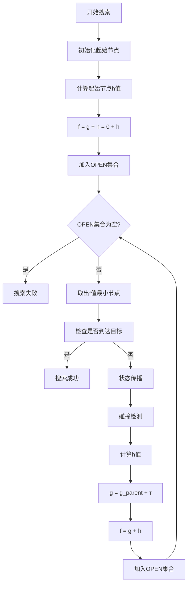

# KinodynamicAstar源码阅读顺序总结

## 📚 **文档索引**

1. **[算法整体架构分析](kinodynamic_astar_architecture.md)** - 算法概述和核心组件
2. **[源码阅读指南](source_code_reading_guide.md)** - 详细的源码阅读顺序和函数分析
3. **[算法流程图详解](algorithm_flow_diagram.md)** - 完整的算法流程图和f、g、h值计算
4. **[函数输入输出说明](function_input_output_specification.md)** - 所有函数的详细输入输出规范
5. **[文件组织分析](file_organization_analysis.md)** - 文件架构和设计理念
6. **[文件组织总结](file_organization_summary.md)** - 问题解答和对比分析

## 🎯 **快速回答你的问题**

### 1. TD graph渲染问题
**问题**: KinodynamicAstar算法整体流程 TD graph不能正常渲染
**解决**: 已将`graph TD`改为`flowchart TD`，现在应该可以正常渲染

### 2. f、g、h值含义
- **g值**: 从起始节点到当前节点的**实际代价**（时间成本）
- **h值**: 从当前节点到目标节点的**启发式估计**（最优时间估计）
- **f值**: **总代价**，f = g + h，用于OPEN集合排序

### 3. 源码阅读顺序建议

#### 🥇 **第一阶段：理解数据结构**
1. **PathNode结构体** (`kinodynamic_astar.h` 第25-40行)
2. **KinodynamicAstar类声明** (`kinodynamic_astar.h` 第42-120行)

#### 🥈 **第二阶段：理解核心算法函数**
1. **init()** - 初始化函数
2. **reset()** - 重置函数  
3. **search()** - 主搜索函数
4. **stateTransit()** - 状态传播函数
5. **estimateHeuristic()** - 启发式函数
6. **isFree()** - 碰撞检测函数
7. **computeShotTraj()** - Shot Trajectory函数

#### 🥉 **第三阶段：理解辅助函数**
1. **getKinoTraj()** - 轨迹生成函数
2. **cubic()** - 三次多项式求解
3. **quartic()** - 四次多项式求解

### 4. 函数输入输出详细说明
所有函数的详细输入输出规范已在 **[函数输入输出说明](function_input_output_specification.md)** 中详细阐述。

## 🔍 **核心算法流程**

## 📖 **推荐阅读路径**

### 路径1：算法理解优先
1. 先读 **[算法整体架构分析](kinodynamic_astar_architecture.md)**
2. 再看 **[算法流程图详解](algorithm_flow_diagram.md)**
3. 最后读 **[源码阅读指南](source_code_reading_guide.md)**

### 路径2：源码实现优先
1. 先读 **[源码阅读指南](source_code_reading_guide.md)**
2. 参考 **[函数输入输出说明](function_input_output_specification.md)**
3. 结合 **[算法流程图详解](algorithm_flow_diagram.md)** 理解流程

### 路径3：问题导向
1. 先读 **[文件组织总结](file_organization_summary.md)** 了解架构
2. 根据具体问题选择相应文档
3. 使用 **[函数输入输出说明](function_input_output_specification.md)** 作为参考手册

## 🛠️ **调试建议**

### 关键调试点
1. **状态传播**: 检查双积分器模型计算
2. **启发式计算**: 验证四次多项式求解
3. **碰撞检测**: 确认ESDF查询结果
4. **f值更新**: 检查g和h值计算

### 可视化建议
1. **搜索树**: 可视化OPEN集合和已扩展节点
2. **轨迹**: 显示生成的路径和轨迹
3. **状态空间**: 6维状态空间的可视化
4. **性能**: 搜索时间和内存使用情况

## 📝 **学习要点**

### 必须理解的概念
1. **6维状态空间**: [x,y,z,vx,vy,vz]
2. **双积分器模型**: 状态传播的物理基础
3. **A*算法**: f、g、h值的含义和计算
4. **动力学约束**: 速度、加速度限制
5. **ESDF环境**: 碰撞检测和环境查询

### 常见问题解答
1. **为什么使用6维状态空间？**: 考虑位置和速度，满足动力学约束
2. **如何选择时间步长？**: 平衡计算效率和精度
3. **启发式函数如何设计？**: 平衡路径长度和时间成本
4. **如何处理动态环境？**: 扩展到4D空间 (x,y,z,t)

## 🎉 **总结**

通过这套完整的文档，你应该能够：
- ✅ 理解KinodynamicAstar算法的整体架构
- ✅ 掌握f、g、h值的含义和计算方法
- ✅ 按照建议顺序阅读和理解源码
- ✅ 了解每个函数的输入输出和功能
- ✅ 解决TD graph渲染问题
- ✅ 进行有效的调试和可视化

建议按照 **路径1：算法理解优先** 的顺序阅读，这样可以先建立整体概念，再深入源码细节。
