# KinodynamicAstar算法详细流程图

## 1. f、g、h值计算详解

### 1.1 g值计算 (实际代价)
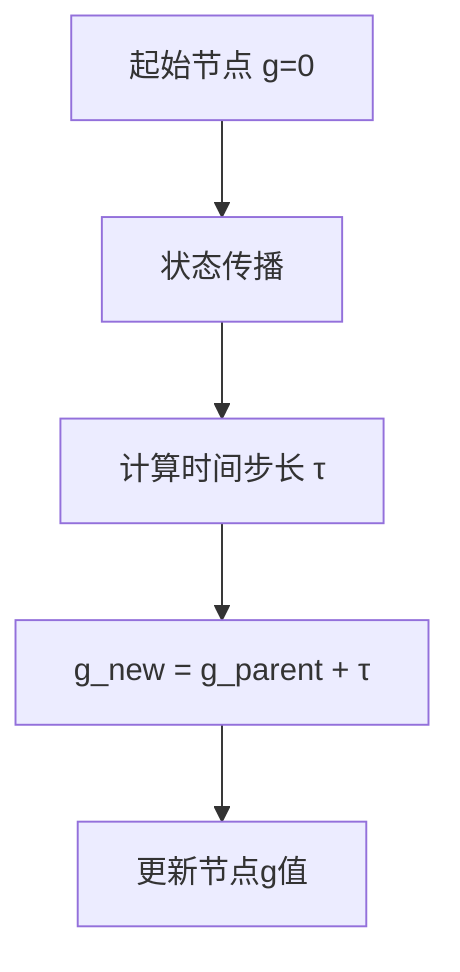

**代码实现**:
```cpp
// 在状态传播过程中
double duration = tau;  // 时间步长
neighbor->g_score = cur_node->g_score + duration;
```

### 1.2 h值计算 (启发式估计)
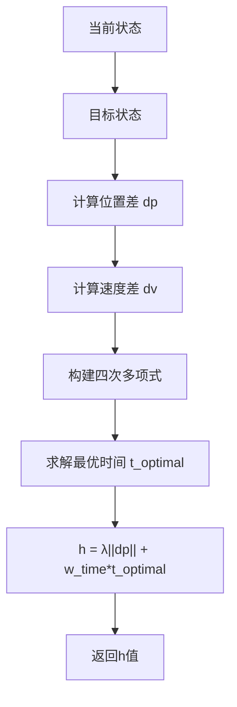

**代码实现**:
```cpp
double estimateHeuristic(Eigen::VectorXd x1, Eigen::VectorXd x2, double& optimal_time) {
    Eigen::Vector3d dp = x2.head(3) - x1.head(3);
    Eigen::Vector3d v0 = x1.tail(3);
    Eigen::Vector3d v1 = x2.tail(3);
    
    // 构建四次多项式系数
    double c1 = -36.0 * dp.dot(dp);
    double c2 = 24.0 * (v0 + v1).dot(dp);
    double c3 = -4.0 * (v0.dot(v0) + v0.dot(v1) + v1.dot(v1));
    double c4 = 0;
    double c5 = w_time_;
    
    // 求解最优时间
    std::vector<double> ts = quartic(c5, c4, c3, c2, c1);
    
    // 选择最小代价
    double cost = std::numeric_limits<double>::max();
    for (double t : ts) {
        if (t < 0) continue;
        double c = w_time_ * t + lambda_heu_ * dp.norm() / t;
        if (c < cost) {
            cost = c;
            optimal_time = t;
        }
    }
    
    return cost;
}
```

### 1.3 f值计算 (总代价)
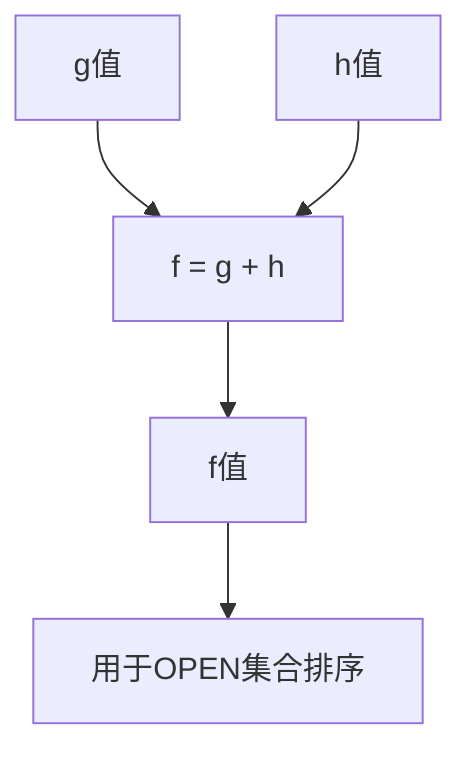

**代码实现**:
```cpp
// 在节点创建时
neighbor->f_score = neighbor->g_score + h_score;
```

## 2. 完整算法流程图

### 2.1 主搜索循环
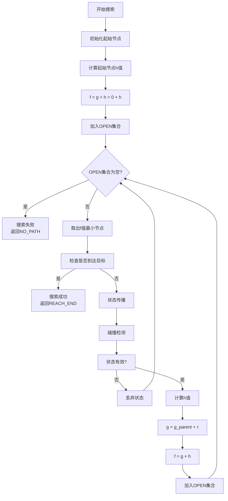

### 2.2 状态传播详细过程
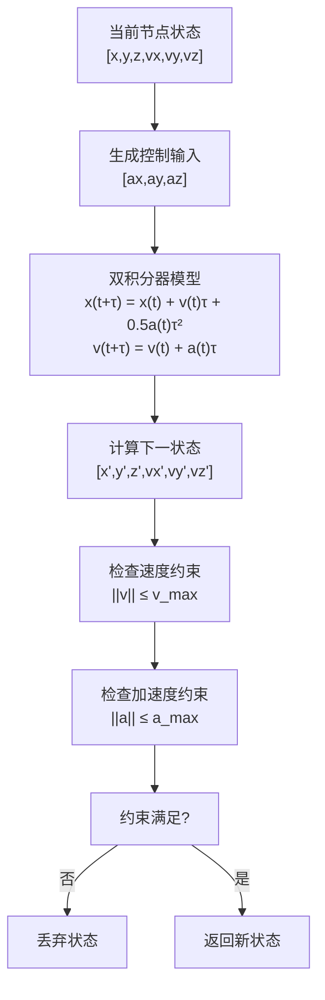

### 2.3 碰撞检测过程
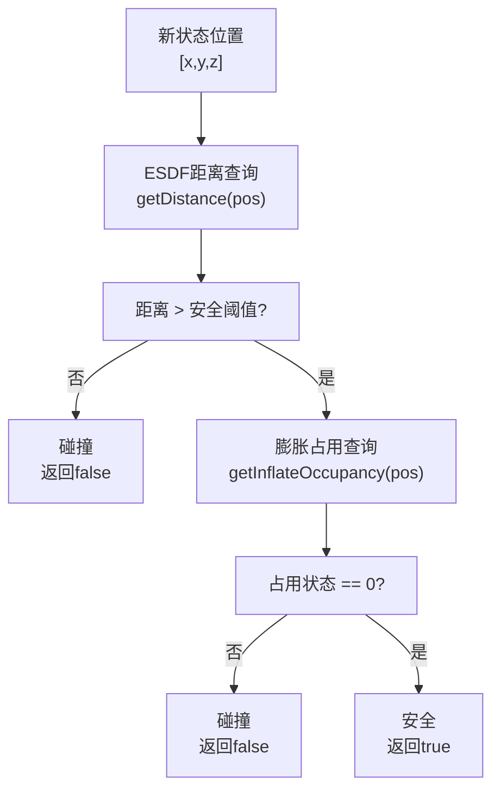

### 2.4 Shot Trajectory计算
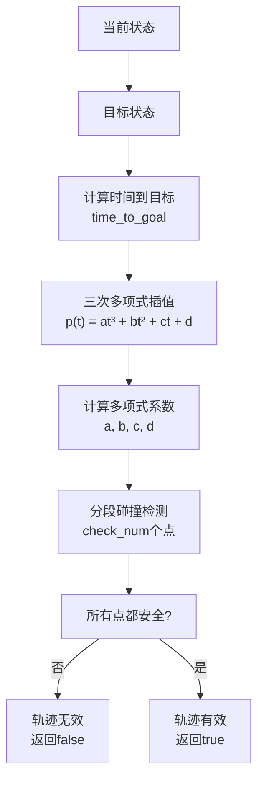

## 3. 关键数据结构流程图

### 3.1 节点创建和管理
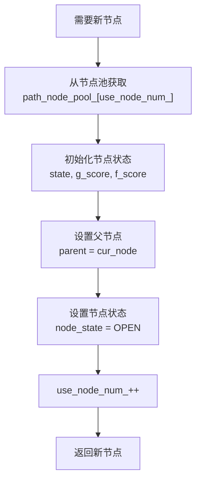

### 3.2 OPEN集合管理
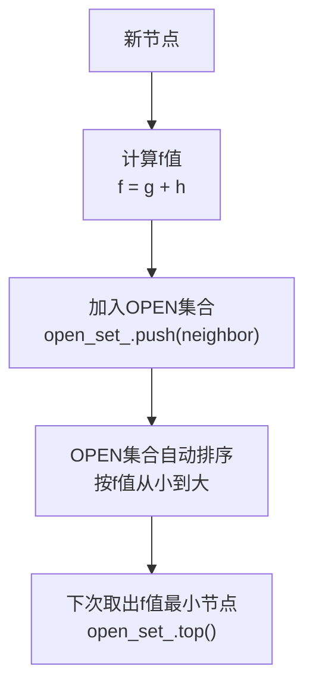

### 3.3 已扩展节点管理
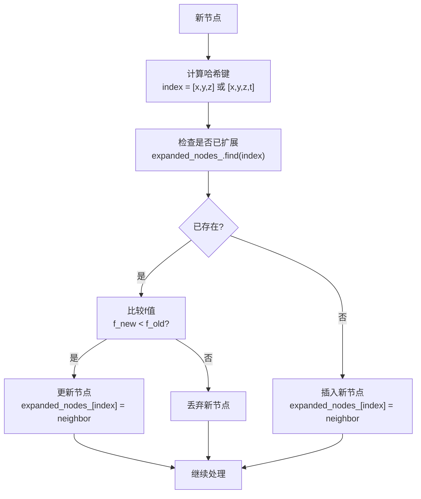

## 4. 算法参数影响分析

### 4.1 关键参数对算法性能的影响

| 参数 | 影响 | 建议值 | 说明 |
|------|------|--------|------|
| `max_tau_` | 时间步长 | 0.6s | 影响搜索精度和速度 |
| `max_vel_` | 最大速度 | 3.0 m/s | 动力学约束 |
| `max_acc_` | 最大加速度 | 2.0 m/s² | 动力学约束 |
| `w_time_` | 时间权重 | 10.0 | 平衡时间和距离 |
| `lambda_heu_` | 启发式权重 | 5.0 | 影响搜索方向 |
| `allocate_num_` | 节点池大小 | 100000 | 内存管理 |
| `check_num_` | 碰撞检测点数 | 5 | 轨迹安全性 |

### 4.2 参数调优建议

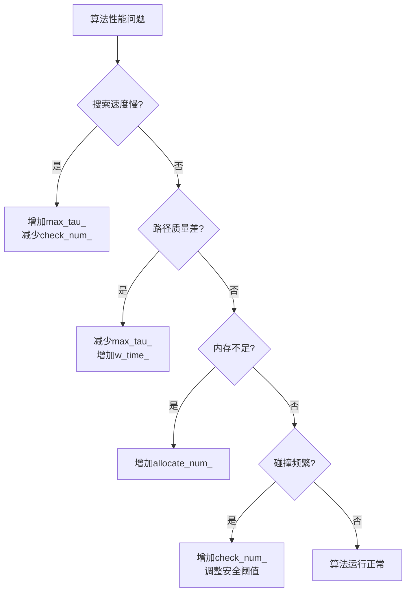

## 5. 调试和可视化建议

### 5.1 关键调试点
1. **状态传播**: 检查双积分器模型计算
2. **启发式计算**: 验证四次多项式求解
3. **碰撞检测**: 确认ESDF查询结果
4. **f值更新**: 检查g和h值计算

### 5.2 可视化建议
1. **搜索树**: 可视化OPEN集合和已扩展节点
2. **轨迹**: 显示生成的路径和轨迹
3. **状态空间**: 6维状态空间的可视化
4. **性能**: 搜索时间和内存使用情况

这个详细的流程图和说明应该能帮助你更好地理解KinodynamicAstar算法的实现细节和源码阅读顺序。
