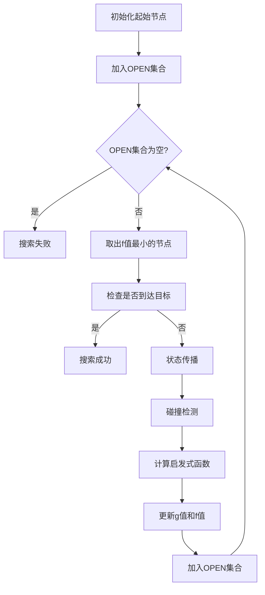

# KinodynamicAstar算法整体架构分析

## 1. 算法概述

KinodynamicAstar是一种考虑动力学约束的A*路径搜索算法，专门用于无人机等动态系统的路径规划。该算法在传统A*的基础上，将状态空间扩展到包含位置、速度、加速度的6维空间，并考虑系统的动力学约束。

## 2. 核心组件架构

### 2.1 主要类结构

```
KinodynamicAstar
├── PathNode (路径节点)
├── NodeHashTable (节点哈希表)
├── NodeComparator (节点比较器)
└── EDTEnvironment (环境接口)
```

### 2.2 关键数据结构

#### PathNode (路径节点)
```cpp
class PathNode {
    Eigen::Vector3i index;           // 3D网格索引
    Eigen::Matrix<double, 6, 1> state; // 6维状态 [x,y,z,vx,vy,vz]
    double g_score, f_score;         // A*算法的g值和f值
    Eigen::Vector3d input;           // 控制输入 [ax,ay,az]
    double duration;                 // 时间步长
    double time;                     // 时间戳
    int time_idx;                    // 时间索引
    PathNode* parent;                // 父节点指针
    char node_state;                 // 节点状态 (OPEN/CLOSE/NOT_EXPAND)
};
```

#### NodeHashTable (节点哈希表)
- **3D哈希表**: 用于静态环境，索引为 `(x,y,z)`
- **4D哈希表**: 用于动态环境，索引为 `(x,y,z,t)`
- **功能**: 快速查找已访问的节点，避免重复扩展

## 3. 算法流程

### 3.1 搜索主循环



### 3.2 状态传播 (State Propagation)

状态传播是算法的核心，使用双积分器模型：

```
x(t+τ) = x(t) + v(t)τ + 0.5*a(t)τ²
v(t+τ) = v(t) + a(t)τ
```

其中：
- `x`: 位置向量
- `v`: 速度向量  
- `a`: 加速度向量
- `τ`: 时间步长

### 3.3 f、g、h值详解

#### g值 (实际代价)
- **定义**: 从起始节点到当前节点的实际代价
- **计算**: `g_new = g_parent + duration`
- **物理意义**: 从起始状态到当前状态的实际时间成本
- **更新**: 在状态传播过程中累积时间步长

#### h值 (启发式估计)
使用欧几里得距离和时间成本的加权组合：

```
h(n) = λ * ||p_goal - p_current|| + w_time * t_optimal
```

其中：
- `λ`: 启发式权重 (lambda_heu_)
- `w_time`: 时间权重
- `t_optimal`: 最优时间估计 (通过四次多项式求解)

#### f值 (总代价)
- **定义**: `f(n) = g(n) + h(n)`
- **用途**: 用于OPEN集合的优先级排序
- **优化**: 选择f值最小的节点进行扩展

## 4. 关键算法特性

### 4.1 动力学约束处理

- **速度约束**: `||v|| ≤ v_max`
- **加速度约束**: `||a|| ≤ a_max`
- **时间约束**: 考虑最小/最大时间步长

### 4.2 Shot Trajectory (直达轨迹)

当搜索接近目标时，尝试计算从当前状态到目标状态的直达轨迹：

```cpp
bool computeShotTraj(Eigen::VectorXd state1, Eigen::VectorXd state2, double time_to_goal);
```

使用三次或四次多项式插值，确保满足动力学约束。

### 4.3 动态环境支持

- **时间维度**: 在4D空间中搜索 `(x,y,z,t)`
- **动态障碍物**: 通过EDTEnvironment接口获取动态ESDF
- **时间索引**: 将连续时间离散化为时间索引

## 5. 参数配置V

### 5.1 搜索参数
```cpp
double max_tau_;           // 最大时间步长
double init_max_tau_;      // 初始最大时间步长
double max_vel_;           // 最大速度
double max_acc_;           // 最大加速度
double w_time_;            // 时间权重
double horizon_;           // 搜索视野
double lambda_heu_;        // 启发式权重
int allocate_num_;         // 预分配节点数
int check_num_;            // 碰撞检测点数
bool optimistic_;          // 乐观搜索模式
```

### 5.2 地图参数
```cpp
double resolution_;        // 空间分辨率
double time_resolution_;   // 时间分辨率
Eigen::Vector3d origin_;   // 地图原点
Eigen::Vector3d map_size_3d_; // 地图尺寸
```

## 6. 性能优化

### 6.1 内存管理
- **节点池**: 预分配固定数量的节点，避免频繁内存分配
- **哈希表**: 使用unordered_map实现O(1)查找
- **智能指针**: 使用shared_ptr管理环境对象

### 6.2 搜索优化
- **Tie Breaker**: 处理f值相等的情况
- **乐观搜索**: 优先扩展有希望到达目标的节点
- **早期终止**: 找到可行路径后可以提前终止

## 7. 接口设计

### 7.1 主要API
```cpp
// 设置参数
void setParam(rclcpp::Node::SharedPtr node);

// 初始化
void init();

// 重置搜索
void reset();

// 主搜索函数
int search(Eigen::Vector3d start_pt, Eigen::Vector3d start_vel,
           Eigen::Vector3d start_acc, Eigen::Vector3d end_pt,
           Eigen::Vector3d end_vel, bool init, bool dynamic = false,
           double time_start = -1.0);

// 设置环境
void setEnvironment(const std::shared_ptr<plan_env::EDTEnvironment>& env);

// 获取轨迹
std::vector<Eigen::Vector3d> getKinoTraj(double delta_t);
```

### 7.2 返回状态
```cpp
enum { 
    REACH_HORIZON = 1,  // 到达搜索视野
    REACH_END = 2,      // 到达目标
    NO_PATH = 3,        // 无可行路径
    NEAR_END = 4        // 接近目标
};
```

## 8. 与环境的交互

### 8.1 EDTEnvironment接口
```cpp
class EDTEnvironment {
public:
    virtual double getDistance(const Eigen::Vector3d& pos) = 0;
    virtual int getInflateOccupancy(const Eigen::Vector3d& pos) = 0;
    virtual void getSurroundPts(const Eigen::Vector3d& pos, 
                                Eigen::Vector3d pts[2][2][2], 
                                Eigen::Vector3d& diff) = 0;
    virtual void getRegion(Eigen::Vector3d& ori, Eigen::Vector3d& size) = 0;
    virtual double getResolution() = 0;
    virtual Eigen::Vector3d getOrigin() = 0;
};
```

### 8.2 碰撞检测
- **ESDF查询**: 通过`getDistance()`获取到最近障碍物的距离
- **膨胀占用**: 通过`getInflateOccupancy()`检查膨胀后的占用状态
- **安全距离**: 确保路径与障碍物保持安全距离

## 9. 算法优势

1. **动力学可行性**: 生成的路径满足系统的动力学约束
2. **实时性**: 通过启发式搜索和优化策略保证实时性能
3. **鲁棒性**: 支持动态环境和复杂约束
4. **可扩展性**: 模块化设计便于扩展和定制

## 10. 应用场景

- **无人机路径规划**: 考虑飞行器的动力学特性
- **机器人导航**: 在动态环境中的安全导航
- **自动驾驶**: 考虑车辆动力学约束的路径规划
- **多智能体系统**: 考虑时间维度的协调规划

## 11. 总结

KinodynamicAstar算法通过将传统A*扩展到6维状态空间，成功解决了考虑动力学约束的路径规划问题。其核心创新在于：

1. **状态空间扩展**: 从3D位置空间扩展到6D状态空间
2. **动力学约束**: 集成速度、加速度约束到搜索过程中
3. **时间维度**: 支持动态环境和时间相关的规划
4. **启发式设计**: 平衡路径长度和时间成本

该算法为现代移动机器人系统提供了高效、可靠的路径规划解决方案。
