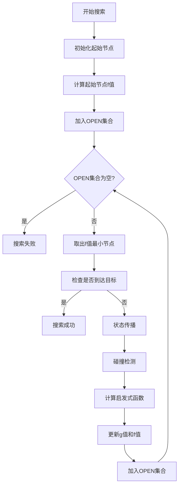
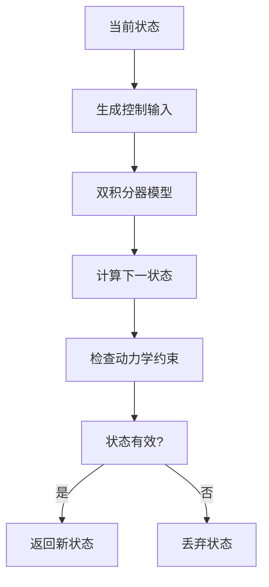
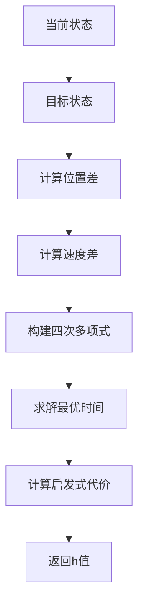

# KinodynamicAstar源码阅读指南

## 1. A*算法中的f、g、h值含义

### 1.1 基本概念
- **g(n)**: 从起始节点到当前节点n的实际代价
- **h(n)**: 从当前节点n到目标节点的启发式估计代价
- **f(n)**: 总代价，f(n) = g(n) + h(n)

### 1.2 在KinodynamicAstar中的具体含义

#### g值 (实际代价)
```cpp
double g_score;  // 从起点到当前节点的实际代价
```
- **物理意义**: 从起始状态到当前状态的实际时间成本
- **计算方式**: 累积所有状态转移的时间步长
- **更新规则**: `g_new = g_parent + duration`

#### h值 (启发式估计)
```cpp
double estimateHeuristic(Eigen::VectorXd x1, Eigen::VectorXd x2, double& optimal_time);
```
- **物理意义**: 从当前状态到目标状态的最优时间估计
- **计算方式**: 使用四次多项式求解最优时间
- **公式**: `h = λ * ||p_goal - p_current|| + w_time * t_optimal`

#### f值 (总代价)
```cpp
double f_score;  // f = g + h
```
- **物理意义**: 通过当前节点的路径总代价估计
- **用途**: 用于OPEN集合的优先级排序
- **优化**: 选择f值最小的节点进行扩展

## 2. 源码阅读顺序建议

### 2.1 第一阶段：理解数据结构 (建议顺序)

#### 1. PathNode结构体
**文件**: `kinodynamic_astar.h` (第25-40行)
```cpp
struct PathNode {
    Eigen::Vector3i index;           // 3D网格索引
    Eigen::Matrix<double, 6, 1> state; // 6维状态 [x,y,z,vx,vy,vz]
    double g_score, f_score;         // A*算法的g值和f值
    Eigen::Vector3d input;           // 控制输入 [ax,ay,az]
    double duration;                 // 时间步长
    double time;                     // 时间戳
    int time_idx;                    // 时间索引
    PathNode* parent;                 // 父节点指针
    char node_state;                 // 节点状态
};
```
**理解要点**:
- 6维状态空间：位置(3D) + 速度(3D)
- 控制输入：加速度向量
- 时间信息：duration和time_idx

#### 2. KinodynamicAstar类声明
**文件**: `kinodynamic_astar.h` (第42-120行)
```cpp
class KinodynamicAstar {
private:
    // 核心数据结构
    std::vector<PathNodePtr> path_nodes_;           // 路径节点列表
    std::priority_queue<PathNodePtr, std::vector<PathNodePtr>, NodeComparator> open_set_;  // OPEN集合
    std::unordered_map<Eigen::Vector3i, PathNodePtr, matrix_hash<Eigen::Vector3i>> expanded_nodes_;  // 已扩展节点
    std::unordered_map<Eigen::Vector4i, PathNodePtr, matrix_hash<Eigen::Vector4i>> expanded_nodes_dynamic_;  // 动态环境已扩展节点
    
    // 节点池管理
    std::vector<PathNodePtr> path_node_pool_;      // 节点池
    int use_node_num_;                             // 已使用节点数
    int iter_num_;                                 // 迭代次数
    
    // 环境接口
    std::shared_ptr<plan_env::EDTEnvironment> edt_environment_;  // EDT环境
};
```

### 2.2 第二阶段：理解核心算法函数 (建议顺序)

#### 1. 初始化函数
**文件**: `kinodynamic_astar.cpp` (第350-370行)
```cpp
void KinodynamicAstar::init() {
    // 获取地图尺寸
    edt_environment_->getMapSize(map_size_3d_);
    
    // 初始化节点池
    path_node_pool_.resize(allocate_num_);
    for (int i = 0; i < allocate_num_; ++i) {
        path_node_pool_[i] = new PathNode;
    }
    
    // 重置搜索状态
    reset();
}
```
**输入**: 无
**输出**: 无
**功能**: 初始化算法，分配内存，重置状态

#### 2. 重置函数
**文件**: `kinodynamic_astar.cpp` (第372-390行)
```cpp
void KinodynamicAstar::reset() {
    // 清空路径节点
    path_nodes_.clear();
    
    // 清空OPEN集合
    std::priority_queue<PathNodePtr, std::vector<PathNodePtr>, NodeComparator> empty_queue;
    open_set_.swap(empty_queue);
    
    // 重置节点池
    for (int i = 0; i < use_node_num_; ++i) {
        PathNodePtr node = path_node_pool_[i];
        node->parent = NULL;
        node->node_state = NOT_EXPAND;
    }
    use_node_num_ = 0;
    iter_num_ = 0;
}
```
**输入**: 无
**输出**: 无
**功能**: 重置搜索状态，清空所有数据结构

#### 3. 主搜索函数
**文件**: `kinodynamic_astar.cpp` (第25-150行)
```cpp
int KinodynamicAstar::search(Eigen::Vector3d start_pt, Eigen::Vector3d start_vel,
                            Eigen::Vector3d start_acc, Eigen::Vector3d end_pt,
                            Eigen::Vector3d end_vel, bool init, bool dynamic = false,
                            double time_start = -1.0) {
    // 参数
    start_pt: 起始位置 [x,y,z]
    start_vel: 起始速度 [vx,vy,vz]
    start_acc: 起始加速度 [ax,ay,az]
    end_pt: 目标位置 [x,y,z]
    end_vel: 目标速度 [vx,vy,vz]
    init: 是否初始化搜索
    dynamic: 是否为动态环境
    time_start: 起始时间
    
    // 返回值
    REACH_HORIZON = 1,  // 到达搜索视野
    REACH_END = 2,      // 到达目标
    NO_PATH = 3,        // 无可行路径
    NEAR_END = 4        // 接近目标
}
```
**输入**: 起始状态、目标状态、搜索参数
**输出**: 搜索状态码
**功能**: 执行A*搜索算法的主循环

#### 4. 状态传播函数
**文件**: `kinodynamic_astar.cpp` (第200-250行)
```cpp
void KinodynamicAstar::stateTransit(Eigen::VectorXd state0, Eigen::VectorXd state1,
                                   Eigen::Vector3d um, double tau) {
    // 参数
    state0: 当前状态 [x,y,z,vx,vy,vz]
    state1: 下一状态 [x,y,z,vx,vy,vz] (输出)
    um: 控制输入 [ax,ay,az]
    tau: 时间步长
    
    // 双积分器模型
    for (int i = 0; i < 3; ++i) {
        state1(i) = state0(i) + state0(i + 3) * tau + 0.5 * um(i) * tau * tau;
        state1(i + 3) = state0(i + 3) + um(i) * tau;
    }
}
```
**输入**: 当前状态、控制输入、时间步长
**输出**: 下一状态
**功能**: 根据动力学模型计算状态转移

#### 5. 启发式函数
**文件**: `kinodynamic_astar.cpp` (第400-450行)
```cpp
double KinodynamicAstar::estimateHeuristic(Eigen::VectorXd x1, Eigen::VectorXd x2, double& optimal_time) {
    // 参数
    x1: 当前状态 [x,y,z,vx,vy,vz]
    x2: 目标状态 [x,y,z,vx,vy,vz]
    optimal_time: 最优时间估计 (输出)
    
    // 返回值
    double heuristic_cost;  // 启发式代价
    
    // 计算四次多项式系数
    Eigen::Vector3d dp = x2.head(3) - x1.head(3);
    Eigen::Vector3d v0 = x1.tail(3);
    Eigen::Vector3d v1 = x2.tail(3);
    
    // 求解最优时间
    std::vector<double> ts = quartic(c5, c4, c3, c2, c1);
    ts.push_back(t_bar);
    
    // 选择最小代价
    double cost = std::numeric_limits<double>::max();
    for (double t : ts) {
        if (t < 0) continue;
        double c = w_time_ * t + lambda_heu_ * dp.norm() / t;
        if (c < cost) {
            cost = c;
            optimal_time = t;
        }
    }
    
    return cost;
}
```
**输入**: 当前状态、目标状态
**输出**: 启发式代价、最优时间
**功能**: 计算从当前状态到目标状态的启发式估计

#### 6. 碰撞检测函数
**文件**: `kinodynamic_astar.cpp` (第210-230行)
```cpp
bool KinodynamicAstar::isFree(const Eigen::Vector3d& pos) {
    // 参数
    pos: 位置 [x,y,z]
    
    // 返回值
    bool is_free;  // 是否安全
    
    // 检查ESDF距离
    if (!edt_environment_->isFree(pos)) {
        return false;
    }
    
    // 检查膨胀占用
    if (edt_environment_->getInflateOccupancy(pos) == 1) {
        return false;
    }
    
    return true;
}
```
**输入**: 位置坐标
**输出**: 是否安全
**功能**: 检查位置是否与障碍物碰撞

#### 7. Shot Trajectory函数
**文件**: `kinodynamic_astar.cpp` (第480-520行)
```cpp
bool KinodynamicAstar::computeShotTraj(Eigen::VectorXd state1, Eigen::VectorXd state2, double time_to_goal) {
    // 参数
    state1: 当前状态 [x,y,z,vx,vy,vz]
    state2: 目标状态 [x,y,z,vx,vy,vz]
    time_to_goal: 到达目标的时间
    
    // 返回值
    bool is_valid;  // 轨迹是否有效
    
    // 使用三次多项式插值
    Eigen::Vector3d p0 = state1.head(3);
    Eigen::Vector3d p1 = state2.head(3);
    Eigen::Vector3d v0 = state1.tail(3);
    Eigen::Vector3d v1 = state2.tail(3);
    
    // 计算多项式系数
    Eigen::Vector3d a = 2.0 * (p0 - p1) + (v0 + v1) * time_to_goal;
    Eigen::Vector3d b = 3.0 * (p1 - p0) - (2.0 * v0 + v1) * time_to_goal;
    Eigen::Vector3d c = v0 * time_to_goal;
    Eigen::Vector3d d = p0;
    
    // 碰撞检测
    int num = check_num_;
    double dt = time_to_goal / num;
    for (int i = 0; i <= num; ++i) {
        double t = i * dt;
        Eigen::Vector3d coord = a * t * t * t + b * t * t + c * t + d;
        if (!edt_environment_->isFree(coord)) {
            return false;
        }
    }
    
    return true;
}
```
**输入**: 当前状态、目标状态、时间
**输出**: 轨迹是否有效
**功能**: 计算从当前状态到目标状态的直达轨迹

### 2.3 第三阶段：理解辅助函数 (建议顺序)

#### 1. 轨迹生成函数
**文件**: `kinodynamic_astar.cpp` (第525-580行)
```cpp
std::vector<Eigen::Vector3d> KinodynamicAstar::getKinoTraj(double delta_t) {
    // 参数
    delta_t: 时间步长
    
    // 返回值
    std::vector<Eigen::Vector3d> traj;  // 轨迹点列表
    
    // 从目标节点回溯生成轨迹
    PathNodePtr node = path_nodes_.back();
    std::vector<Eigen::Vector3d> path;
    while (node->parent != NULL) {
        path.push_back(node->state.head(3));
        node = node->parent;
    }
    path.push_back(node->state.head(3));
    
    // 反转路径
    std::reverse(path.begin(), path.end());
    
    // 插值生成轨迹
    for (size_t i = 0; i < path.size() - 1; ++i) {
        Eigen::Vector3d p0 = path[i];
        Eigen::Vector3d p1 = path[i + 1];
        Eigen::Vector3d v0 = node->state.tail(3);
        Eigen::Vector3d v1 = node->parent->state.tail(3);
        
        // 三次多项式插值
        // ... 插值计算 ...
    }
    
    return traj;
}
```
**输入**: 时间步长
**输出**: 轨迹点列表
**功能**: 从搜索路径生成连续轨迹

#### 2. 多项式求解函数
**文件**: `kinodynamic_astar.cpp` (第660-720行)
```cpp
std::vector<double> KinodynamicAstar::cubic(double a, double b, double c, double d) {
    // 参数
    a, b, c, d: 三次多项式系数 ax³ + bx² + cx + d = 0
    
    // 返回值
    std::vector<double> roots;  // 根列表
    
    // 求解三次方程
    // ... 数值求解算法 ...
    
    return roots;
}

std::vector<double> KinodynamicAstar::quartic(double a, double b, double c, double d, double e) {
    // 参数
    a, b, c, d, e: 四次多项式系数 ax⁴ + bx³ + cx² + dx + e = 0
    
    // 返回值
    std::vector<double> roots;  // 根列表
    
    // 求解四次方程
    // ... 数值求解算法 ...
    
    return roots;
}
```
**输入**: 多项式系数
**输出**: 根列表
**功能**: 求解三次和四次多项式的根

## 3. 源码阅读策略

### 3.1 调试建议
1. **设置断点**: 在关键函数入口设置断点
2. **打印状态**: 在状态传播和启发式计算处打印中间结果
3. **可视化**: 使用RViz可视化搜索过程和结果

### 3.2 理解重点
1. **状态空间**: 理解6维状态空间的含义
2. **动力学模型**: 掌握双积分器模型
3. **启发式函数**: 理解时间-空间权衡
4. **碰撞检测**: 掌握ESDF的使用方法

### 3.3 常见问题
1. **为什么使用6维状态空间？**: 考虑位置和速度，满足动力学约束
2. **如何选择时间步长？**: 平衡计算效率和精度
3. **启发式函数如何设计？**: 平衡路径长度和时间成本
4. **如何处理动态环境？**: 扩展到4D空间 (x,y,z,t)

## 4. 算法流程图详解

### 4.1 主搜索循环


### 4.2 状态传播过程


### 4.3 启发式计算过程


这个阅读指南按照从简单到复杂的顺序，帮助你逐步理解KinodynamicAstar算法的实现细节。建议按照建议的顺序阅读源码，并在关键函数处设置断点进行调试。
